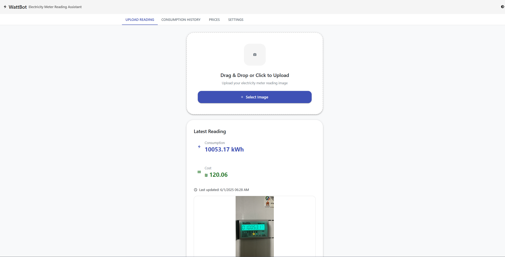

# ⚡️ WattBot – Electricity Meter Reading Assistant



[](https://github.com/NirKli/WattBot/actions/workflows/build-backend.yml)
[](https://github.com/NirKli/WattBot/actions/workflows/build-frontend.yml)
[](https://coveralls.io/github/NirKli/WattBot?branch=main)


[](https://hub.docker.com/r/nirkli/wattbot)
[](https://hub.docker.com/r/nirkli/wattbot-ui)


WattBot is a full-stack web application that lets you upload images of electricity meters and automatically extract
readings using a custom-trained YOLO model.  
The project includes a Python FastAPI backend and a React frontend with support for dark mode, currency selection, and
price tracking.

---

## 🚀 Features

- 📸 Upload electricity meter images
- 🔍 Detect digital readings using a trained YOLO model
- 🌙 Dark mode support
- 💰 Track electricity prices and consumption history
- 🛠 Built with FastAPI (Python) and React + Material UI
- 🐳 Easy deployment via Docker

---

## 🧠 Tech Stack

- **Frontend:** React, Material UI, TypeScript
- **Backend:** FastAPI, Python 3.13, Uvicorn, Pydantic
- **Machine Learning:** YOLOv26s-obb (custom-trained on real electricity meter data)
- **Database:** MongoDB
- **Containerization:** Docker, Docker Compose
- **CI/CD:** GitHub Actions

---

## 📦 Installation

### 🔧 Prerequisites
- [Docker](https://www.docker.com/) & [Docker Compose](https://docs.docker.com/compose/install/)

### 🛠️ Steps

1. **Create a new folder** and save the contents of `docker-compose.yml` from this repo into a file named
   `docker-compose.yml`.

2. **Open a terminal in that folder** and run:

```bash
docker compose pull
docker compose up -d
```

3. **Navigate to the app:**

- Frontend UI: [http://localhost:80](http://localhost:80)
- Backend API docs: [http://localhost:8000/docs](http://localhost:8000/docs)

If you're deploying on a remote server, replace `localhost` with your server's IP (e.g., http://123.123.123.123).


## ⚠️ Model Accuracy Note

The YOLO model was trained on a limited dataset of real electricity meters. If your meter's layout or font style is significantly different, the reading might be misinterpreted.  
If you encounter inaccuracies and want to improve precision for your meter type, feel free to [open an issue](https://github.com/NirKli/WattBot/issues) contributions are welcome!

---

## 🌐 Local Development

### 🔧 Prerequisites

Make sure you have the following installed on your machine:

- [Python 3.11+](https://www.python.org/downloads/)
- [Node.js 18+](https://nodejs.org/)
- [Docker](https://www.docker.com/) & [Docker Compose](https://docs.docker.com/compose/)

### 🧠 Backend (API)

Runs on [http://localhost:8000](http://localhost:8000)

```bash
cd backend
pip install -r requirements.txt
uvicorn main:app --reload
```

Swagger UI available at: [http://localhost:8000/docs](http://localhost:8000/docs)

### 🌍 Frontend (React)

Runs on [http://localhost:5173](http://localhost:5173)

```bash
cd frontend
npm install
npm run dev
```

The dev server automatically proxies API requests to the backend at `http://localhost:8000` — no extra configuration needed.

> **Pointing to a different backend?** Create `frontend/.env.local` with `VITE_API_URL=http://your-backend-url:8000`. This file is gitignored.

---

## 🔍 API Documentation

FastAPI automatically generates interactive API docs:

- [Swagger UI](http://localhost:8000/docs) – Try out endpoints directly from the browser
- [ReDoc](http://localhost:8000/redoc) – Clean reference-style documentation

---

## 📄 License

This project is licensed under the MIT License – see the [LICENSE](./LICENSE) file for details.
