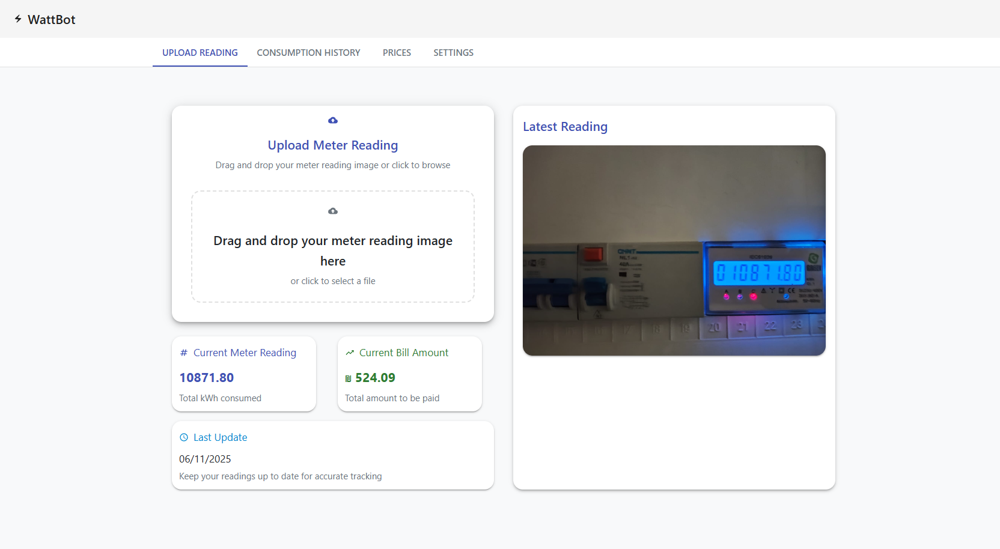

# ⚡️ WattBot – Electricity Meter Reading Assistant

WattBot is a modern web application that allows you to upload images of digital electricity meters and automatically detect readings using machine learning. The project includes a Python FastAPI backend and a React frontend with support for dark mode, currency selection, and price tracking.

---

## 🚀 Features

- 📸 Upload electricity meter images
- 🔍 Detect digital readings using a trained YOLO model
- 🌙 Dark mode support
- 💰 Track electricity prices and consumption history
- 🛠 Built with FastAPI (Python) and React + Tailwind CSS
- 🐳 Easy deployment via Docker

---

## 🧠 Tech Stack

- **Frontend:** React, Tailwind CSS, TypeScript
- **Backend:** FastAPI, Python 3.13, Uvicorn, Pydantic
- **Machine Learning:** YOLOv11x-obb via Ultralytics
- **Database:** MongoDB
- **Containerization:** Docker, Docker Compose
- **CI/CD:** GitHub Actions

---

## 📦 Installation

### 1. Clone the repository

```bash
git clone https://github.com/yourusername/wattbot.git
cd wattbot
```

### 2. Run with Docker Compose

```bash
docker-compose up --build
```

> Make sure you have Docker and Docker Compose installed.

---

## 🖼 Sample

| Upload | Consumption Overview                                 |
|--------|-----------------------------------------|
|  |  |

---

## 🌐 Local Development

### Backend

```bash
cd backend
uvicorn main:app --reload
```

### Frontend

```bash
cd frontend
npm install
npm run dev
```

---

## 🔍 API Documentation

FastAPI automatically generates interactive API docs:

- [Swagger UI](http://localhost:8000/docs) – Try out endpoints directly from the browser
- [ReDoc](http://localhost:8000/redoc) – Clean reference-style documentation

---

## 📄 License

This project is licensed under the MIT License – see the [LICENSE](./LICENSE) file for details.
